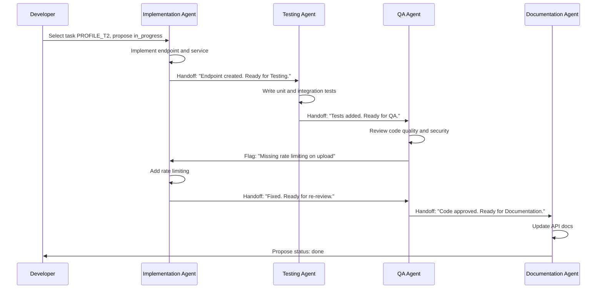

# Task Lifecycle Example: End-to-End Walkthrough

This document walks through a single task from `todo` to `done`, showing how multiple agents collaborate with handoff notes, status transitions, and acceptance criteria verification.

---

## Sequence Diagram



---

## The Task

We will follow **PROFILE_T2_edit_profile** through its full lifecycle.

### Step 1: Task Starts as `todo`

```yaml
- id: PROFILE_T2_edit_profile
  title: "Implement profile editing"
  type: story
  status: todo
  priority: high
  agent_roles:
    - implementation
    - testing
    - quality_assurance
    - documentation
  spec_refs:
    - "PDB: docs/product_design/app_pdb.md — Profile Editing"
  description: >
    Add profile editing functionality with avatar upload, name editing,
    and bio editing. Include validation and error handling.
  code_areas:
    - "src/api/controllers/profileController.ts"
    - "src/services/profileService.ts"
  acceptance_criteria:
    - "User can edit name and bio"
    - "User can upload/change avatar"
    - "Changes save to backend"
    - "Validation works correctly"
    - "Error handling present"
    - "API documentation updated"
  tests:
    - "Unit tests for ProfileService"
    - "Integration test for edit profile endpoint"
  blocked_by:
    - PROFILE_T1_view_profile
  blocks: []
```

---

### Step 2: Implementation Agent Picks Up the Task

The developer (or the AI in an agent session) selects this task and proposes a status change:

> "I'm picking up PROFILE_T2_edit_profile. Proposing `status: in_progress`."

The Implementation Agent:

1. Reads `spec_refs` to understand requirements.
2. Reviews `PROFILE_T1_view_profile` to understand existing code.
3. Implements the `updateProfile` endpoint in `profileController.ts`.
4. Adds `updateProfile` and `uploadAvatar` methods to `profileService.ts`.
5. Adds request validation (name length, bio length, file size).
6. Adds error handling for invalid input and upload failures.

**Task YAML after implementation:**

```yaml
- id: PROFILE_T2_edit_profile
  status: in_progress
  # ... other fields unchanged ...
  notes: >
    Implementation Agent: PUT /api/v1/users/:id/profile endpoint created.
    Avatar upload via multipart form (5MB limit). Name validation (1-100 chars),
    bio validation (max 500 chars). Error handling for invalid input and
    upload failures. Ready for Testing Agent.
```

---

### Step 3: Testing Agent Writes Tests

The Testing Agent reviews the implementation and writes tests:

1. Reads the handoff note and implementation code.
2. Writes unit tests for `ProfileService.updateProfile()` and `uploadAvatar()`.
3. Writes integration tests for `PUT /api/v1/users/:id/profile`.
4. Tests validation edge cases (empty name, oversized file, invalid format).
5. Tests error scenarios (unauthorized, user not found).

**Task YAML after testing:**

```yaml
- id: PROFILE_T2_edit_profile
  status: in_progress
  # ... other fields unchanged ...
  notes: >
    Implementation Agent: PUT /api/v1/users/:id/profile endpoint created.
    Avatar upload via multipart form (5MB limit). Name validation (1-100 chars),
    bio validation (max 500 chars). Ready for Testing Agent.

    Testing Agent: 12 unit tests and 6 integration tests added. All passing.
    Covered: valid edit, name/bio validation, avatar upload/rejection,
    unauthorized access, user not found. Ready for QA Agent.
```

---

### Step 4: QA Agent Reviews

The QA Agent reviews the code and tests from a quality and security perspective:

1. Checks architecture compliance (controller → service → repository pattern).
2. Reviews error handling completeness.
3. Checks for security issues.
4. **Flags an issue**: The avatar upload endpoint is missing rate limiting, which could allow abuse.

**Task YAML after QA review:**

```yaml
- id: PROFILE_T2_edit_profile
  status: in_progress
  notes: >
    Implementation Agent: PUT /api/v1/users/:id/profile endpoint created. [...]

    Testing Agent: 12 unit tests and 6 integration tests added. All passing. [...]

    QA Agent: Code follows architecture patterns. Error handling is solid.
    ISSUE: Avatar upload endpoint missing rate limiting — could allow
    storage abuse. Recommend adding rate limit (e.g., 10 uploads/hour/user).
    Sending back to Implementation Agent.
```

---

### Step 5: Implementation Agent Fixes the Issue

The Implementation Agent addresses the QA feedback:

1. Adds per-user rate limiting to the upload endpoint (10 uploads/hour).
2. Returns `429 Too Many Requests` when limit exceeded.
3. Updates tests to cover rate limiting.

**Task YAML after fix:**

```yaml
  notes: >
    [... previous notes ...]

    Implementation Agent: Rate limiting added (10 uploads/hour/user).
    Returns 429 when exceeded. Test added for rate limit scenario.
    Ready for QA re-review.

    QA Agent: Rate limiting confirmed. All checks pass. Code approved.
    Ready for Documentation Agent.
```

---

### Step 6: Documentation Agent Updates Docs

The Documentation Agent:

1. Updates API documentation with the new `PUT /api/v1/users/:id/profile` endpoint.
2. Documents request format (multipart form), validation rules, and error responses.
3. Documents rate limiting behavior.
4. Reviews all acceptance criteria.

---

### Step 7: Final Status — `done`

The Documentation Agent validates all acceptance criteria are met and proposes the final status:

```yaml
- id: PROFILE_T2_edit_profile
  title: "Implement profile editing"
  type: story
  status: done
  priority: high
  agent_roles:
    - implementation
    - testing
    - quality_assurance
    - documentation
  spec_refs:
    - "PDB: docs/product_design/app_pdb.md — Profile Editing"
  description: >
    Add profile editing functionality with avatar upload, name editing,
    and bio editing. Include validation and error handling.
  code_areas:
    - "src/api/controllers/profileController.ts"
    - "src/services/profileService.ts"
  acceptance_criteria:
    - "User can edit name and bio"
    - "User can upload/change avatar"
    - "Changes save to backend"
    - "Validation works correctly"
    - "Error handling present"
    - "API documentation updated"
  tests:
    - "Unit tests for ProfileService"
    - "Integration test for edit profile endpoint"
  blocked_by:
    - PROFILE_T1_view_profile
  blocks: []
  notes: >
    Implementation Agent: PUT /api/v1/users/:id/profile endpoint created.
    Avatar upload via multipart form (5MB limit). Name validation (1-100 chars),
    bio validation (max 500 chars). Error handling for invalid input and
    upload failures.

    Testing Agent: 12 unit tests and 6 integration tests added. All passing.
    Covered: valid edit, name/bio validation, avatar upload/rejection,
    unauthorized access, user not found.

    QA Agent: Architecture compliance verified. Rate limiting issue identified
    and resolved. All checks pass.

    Implementation Agent: Rate limiting added (10 uploads/hour/user).

    Documentation Agent: API docs updated with endpoint details, validation
    rules, error responses, and rate limiting. All acceptance criteria met.
    Proposing status: done.
```

---

## Key Takeaways

1. **Status transitions are explicit**: Each agent proposes status changes rather than silently applying them.
2. **Handoff notes are concrete**: Each note says what was done, what files were touched, and who should go next.
3. **Issues flow back**: When QA flags a problem, the task goes back to the responsible agent without resetting progress.
4. **Final validation**: The last agent checks all acceptance criteria before proposing `done`.
5. **Notes accumulate**: The task's `notes` field becomes a complete history of how the feature was built.

---

## Related Documentation

- [MULTI_AGENT_WORKFLOW.md](./MULTI_AGENT_WORKFLOW.md) -- Workflow patterns and handoff protocol
- [DEVELOPMENT_WORKFLOW.md](./DEVELOPMENT_WORKFLOW.md) -- General development workflow
- [TASK_SCHEMA_GUIDE.md](../tasks/TASK_SCHEMA_GUIDE.md) -- Task schema reference
